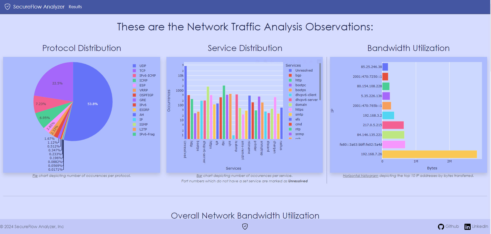
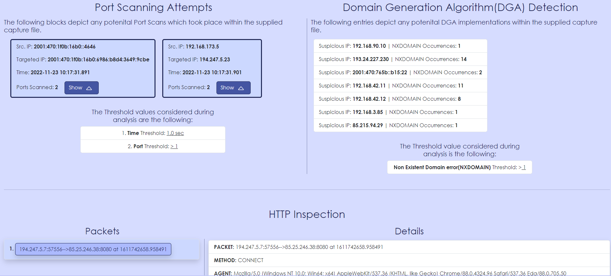

# SecureFlow-Analyzer

## Overview

This is a <ins>Network Traffic Analysis & Anomaly Detection</ins> tool, intended for clear representation of outcomes regarding post-incident analysis as well as network details. **SecureFlow-Analyzer** is developed in [Python](https://www.python.org/) and makes use of the well-known packet manipulation library [Scapy](https://scapy.net/). Furthermore, [Django](https://www.djangoproject.com/) is utilized as the web framework placing everyting together to provide a user-friendly dashboard.

- **Overview of network details**: Easily interpreted visualization of network information.
- **Useful for Post-Incident Analysis**: Identification of entry points and attribution of malicious events.
- **User-defined Thresholds**: One is able to adjust thresholds according their own organization's "normal" network traffic.
- **User-Friendly Interface**: Intuitive interface for easy navigation and configuration.

## Features

- **Multi-Layer Protocol Distribution**
- **Bandwidth Utilization**
- **List of Communication Conversations**
- **IP Geolocation**
- **Detection of Insecure Services Implementation**:
  - telnet, smb, etc.
- **Identification of Malicious IP Addresses & Domains**
- **Detection of Denial-of-Service Attacks**:
  - Ping-of-Death
  - ICMP Flood
  - UDP Flood
  - TCP(SYN) Flood
- **Detection of Port Scans**
- **Identification of Domain Generation Algorithms(DGA)**
- **Inspection of HTTP Traffic**:
  - Suspicious HTTP methods
  - Suspicious User-agents
  - Suspicious file downloads
  - Malicious Domains
  - Plain-text credentials transmissions

## Installation

The latest version of [Python](https://www.python.org/downloads/) is required before advancing to the installation guide.

### 1. Set-up Virtual Environment

Create a root directory for the app to be stored & navigate to it.

```Bash
mkdir "example_name"
cd example_name
```

Within it create the Python virtual environment & activate it.

```Bash
python3 -m venv "virtual_environment_name"
virtual_environment_name\Scripts\activate
```

### 2. Clone GitHub Repository

Clone all files using git & change directory to the Django project.

```Bash
git clone https://github.com/JasonGri/SecureFlow-Analyzer.git
cd SecureFlow-Analyzer
```

### 3. Install Dependencies

```Bash
pip3 install -r requirements.txt
```

### 4. Create Configuration Variables File

Run the existing Python script to generate a basic _.env_ configuration file with the bare minimum variables.

```Bash
python3 gen_env.py
```

### 5. Apply Django's Migrations

```Bash
python3 manage.py migrate
```

## Usage

### 1. Start Server

To utilize the tool you can simply host it locally, by default it runs over HTTP at <ins>localhost:8000</ins>.

```Bash
python3 manage.py runserver
```

### 2. Upload File & Adjust Thresholds

Once the server is up and running navigate to the home page over the browser. There
select the file of the captured network traffic you want to be examined. Additionally, multiple thresholds with respect to the DoS, Port scan, and DGA detection features can be adjusted as needed.
-1.png>)

### 3. Observe Results

Upon completion of processing you will be immediately redirected to the <ins>/results</ins> page where you can decide to navigate the _Analysis_ or the _Anomaly Detection_ results respectively.



## Licence

MIT License

Copyright (c) 2024 Jason Grivas

Permission is hereby granted, free of charge, to any person obtaining a copy
of this software and associated documentation files (the "Software"), to deal
in the Software without restriction, including without limitation the rights
to use, copy, modify, merge, publish, distribute, sublicense, and/or sell
copies of the Software, and to permit persons to whom the Software is
furnished to do so, subject to the following conditions:

The above copyright notice and this permission notice shall be included in all
copies or substantial portions of the Software.

THE SOFTWARE IS PROVIDED "AS IS", WITHOUT WARRANTY OF ANY KIND, EXPRESS OR
IMPLIED, INCLUDING BUT NOT LIMITED TO THE WARRANTIES OF MERCHANTABILITY,
FITNESS FOR A PARTICULAR PURPOSE AND NONINFRINGEMENT. IN NO EVENT SHALL THE
AUTHORS OR COPYRIGHT HOLDERS BE LIABLE FOR ANY CLAIM, DAMAGES OR OTHER
LIABILITY, WHETHER IN AN ACTION OF CONTRACT, TORT OR OTHERWISE, ARISING FROM,
OUT OF OR IN CONNECTION WITH THE SOFTWARE OR THE USE OR OTHER DEALINGS IN THE
SOFTWARE.

## Contact

For any questions, feedback, or support inquiries, feel free to reach out to me!

- [LinkedIn](https://www.linkedin.com/in/jason-grivas-b94b7b212/)
- [GitHub](https://github.com/JasonGri)
- [Mail](jasongrivasb@gmail.com)
